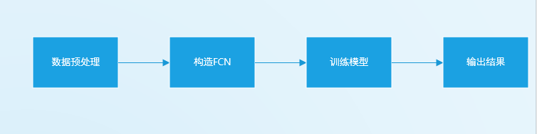
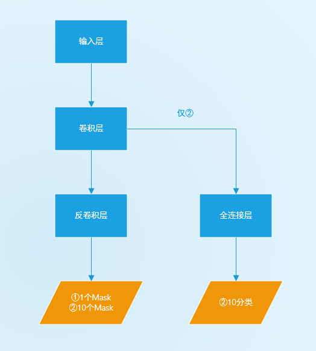
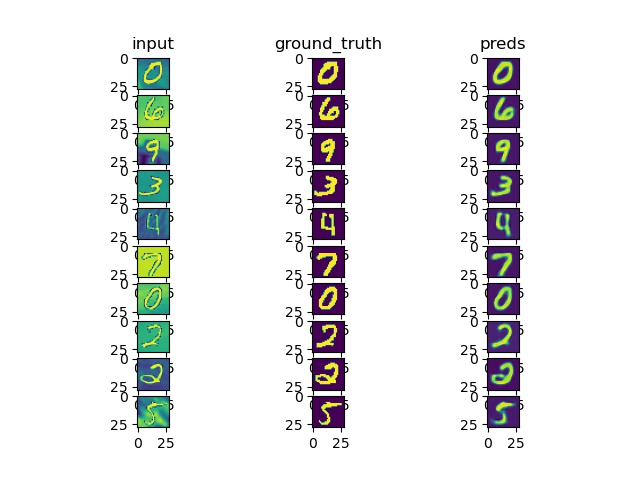
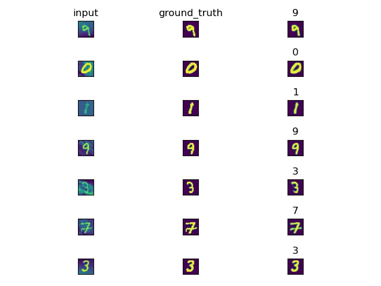

**FCN实现手写数字识别及图像分割**

准备工作
--------

>   系统及运行环境：

>   windows

>   python3.6

>   主要开发包及开源库：

>   torch1.0.1(cuda9.1)

>   numpy

>   matplotlib

>   cv2 3.4.0

实验过程
--------

>   本实验主要采用FCN框架对手写数字进行识别与分割。FCN一个重要优点是可以接受多尺度的图像输入并输出图像，在前景与背景的分割任务中（以下记为①），仅需对图像进行卷积提取特征而后反卷积输出mask即可，在10分类分割任务中（以下记为①）还需输出对物体的分类，根据分类选择对应的mask。实验过程如图所示，详细步骤如下：

流程图

>   1）数据预处理：

>   首先从网上下载数张图片放入imgdata中而后调用deal\_data.py文件输出background.npy用于后续给数字增加背景。调用datasets.MNIST方法加载MNIST数据集。调用addbackground(x)的方法从background.npy中切取随机pench给数字做背景。

>   2）构造FCN：

>   首先，通过多个卷积层和池化层提取图像特征，需要注意的是，maxpool方法引入的量化会使得提取的特征图非常不平滑不利于后续特征的输出，故尽量利用AvgPool。而后利用全卷积层进行特征图到图像的输出，并且设置从卷积层到反卷积的残差反正网络过深引起的梯度消失，或者利用全连接层输出对图像中的数字分类，根据任务类型不同方案各有不同，如下图所示。

>   ①前景背景的分割

>   该任务下直接采用反卷积层输出一个mask即可。

>   ②十分类分割

>   该任务下首先输出10张mask（本次实验没有全是背景的负样本）以及对数字的分类，根据分类选择对应的mask。

>   网络构造示意图

>   3）训练模型：

>   对于任务①采用两张mask的欧式距离作为loss，对于任务②采用两张mask的欧氏距离以及数字分类的交叉熵损失的加权求和作为loss，实验发现该任务中对这个权值并不敏感，对于lambda0采用0.01，1，100模型的准确率差值不到0.2%。采用Dice系数作为模型准确率评判标准。调用train(net,
>   train\_iter, test\_iter, batch\_size, optimizer, device,
>   num\_epochs,loss,lambda0)进行模型训练。

>   4）输出结果：

>   调用matplotlib.pyplot库绘制可视化图表，最后保存到res.jpg文件中，将训练损失，训练集准确率，验证集准确率依次输出到屏幕中。

实验结果
--------

>   实验的结果如下图所示，其中二分类模型的准确率为86.1%，十分类模型的准确率为88.1%，可见引入分类结果加入参考有助于图像分割任务。

二分类任务结果

十分类任务结果
